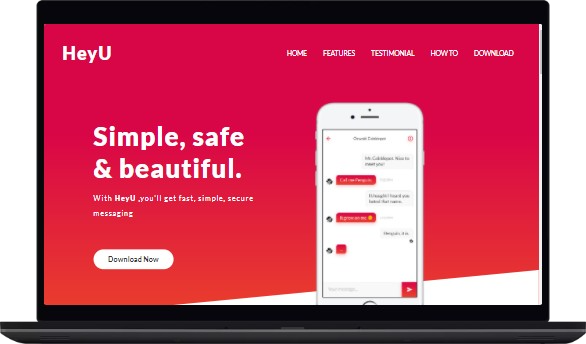

# HeyU Messaging

## HeyU full responsive website Using HTML, CSS, SASS & JavaScript.

#

_HeyU Messaging_

# [Live link](https://mahabub-bd.github.io/heyU/)

# [Github repositorie Link](https://github.com/mahabub-bd/heyU)

<h3 align="left">Connect with me:</h3>

